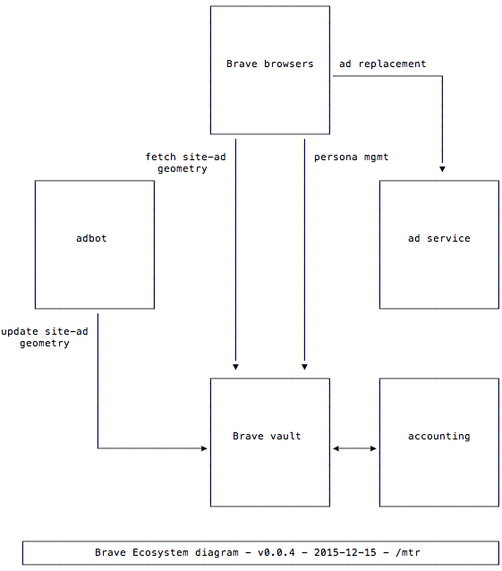

# Brave Vault

A personal data store for holding high-value user behavior with high privacy.

## Setup

Clone the repo: `git clone git@github.com:brave/vault.git`

Install dependencies with `npm install`

Install MongoDB: `brew update && brew install mongodb`

Start MongoDB. There are a variety of ways to do this, one option on a mac: `brew tap homebrew/services && brew services start mongodb`

## StandardJS

For linting we use [StandardJS](https://github.com/feross/standard). It's recommended that you install the necessary IDE plugin. Since this repo uses ES7 features, you'll need a global install of both the standard and babel-eslint packages.

## Configuration

For staging or production environments configuration variables are stored as environment preferences. See config/config.production.js for a list of these variables.

For local development you can copy config/config.development.js.tpl to config/config.development.js and define the local config variables.

## Running the server

Use `gulp` to run the server in development. This also sets up watchers and will restart the server on a file change.

## Proximo

Proximo is currently used as a proxy so we can make outbound vault requests using a static IP. 
Instead of using the `Profile` and `bin/proximo` `vendor/dante`,
so `process.env.BITGO_USE_PROXY` is defined instead.

## Theory of Operation
All operations are available via only HTTPS on public-facing systems.
At a minimum,
all requests are logged with method, path, `Host` and `User-Agent` headers, client IP address,
and `sessionId` parameter (if present);
and all responses are logged with code and diagnostic(if any)
All HTTP content is `application/json`.
Commonly used data types are:

| data type     | syntax                                                                                                      |
| -------------:|:----------------------------------------------------------------------------------------------------------- |
| `adUnitId`    | opaque string                                                                                               |
| `data`        | opaque string  (interpreted only by applications)                                                           |
| `diagnostic`  | localized string intended for logging and human consumption                                                 |
| `replacement` | string containing a (possibly) nested HTML tag                                                              |
| `stats`       | a [statistics summary](#statisticssummary) for the user's behavior                                          |
| `userId`      | [UUID v4](https://en.wikipedia.org/wiki/Universally_unique_identifier#Version_4_.28random.29) string        |
| `tagName`     | string identifing an HTML tag (e.g., `'iframe'` for the `<iframe/>` tag)                                    |
| `timestamp`   | opaque string identifying a unique instance of time                                                         |
| `userId`      | [UUID v4](https://en.wikipedia.org/wiki/Universally_unique_identifier#Version_4_.28random.29) string        |

Errors are "boomlets", e.g.,

        {
          "statusCode": 420,
          "error": "Enhance Your Calm",
          "message": "Your repeated violations of the Verbal Morality Statute ..."
        }

Complete <a href='http://vault-staging.brave.com/documentation'>documentation</a>.
